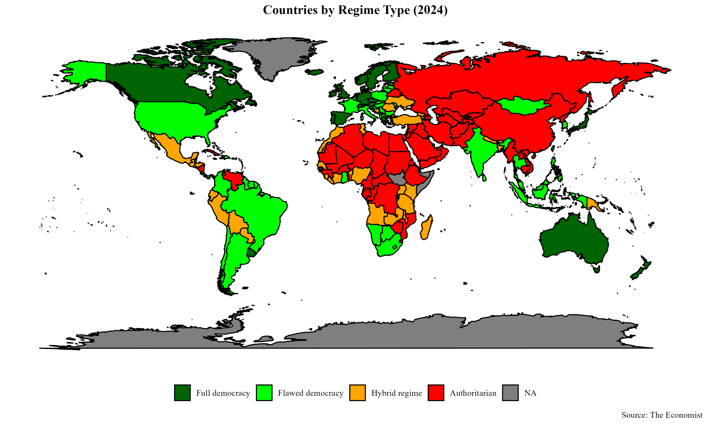
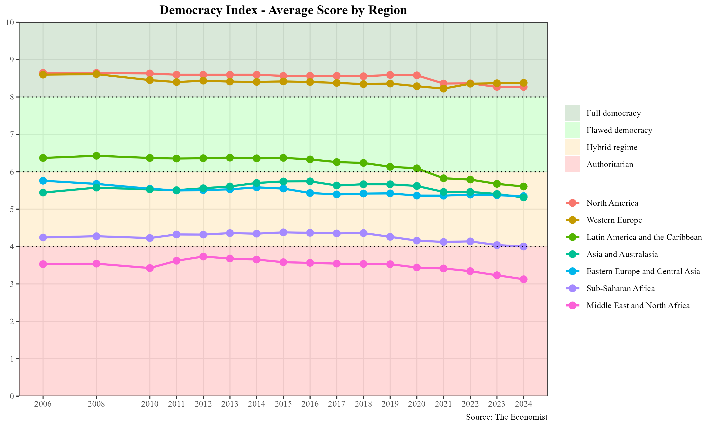

# Democracy Index Analysis (2006–2024)

This project analyzes the Economist's Democracy Index for 167 countries between 2006 and 2024.  
It explores regime types, regional averages, and country-specific trends using R.

## Key Features
- Data scraping from Wikipedia (Democracy Index tables)
- Data cleaning and harmonization of country names
- World map visualizations of regime types and regions
- Country-level trend analysis with custom panel plots

## Tools
- R (tidyverse, ggplot2, janitor, readxl, countrycode, maps)
- Data source: [Wikipedia – Economist Democracy Index](https://en.wikipedia.org/wiki/Democracy_Index)

## Example Output

## Author
Burak Bozkurt
